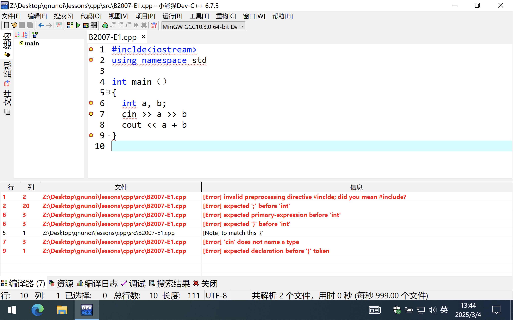
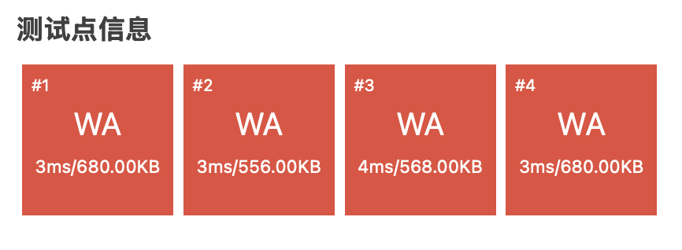
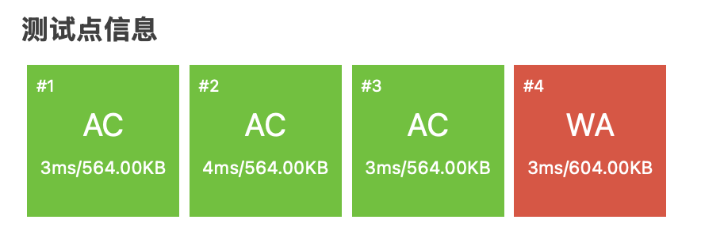

## C++代码调试技巧

### 程序设计是什么

程序设计 = 语言 + 算法 + 数据

### 题目B2007

#### 题目描述

在大部分的在线题库中，都会将 A + B 问题作为第一题，以帮助新手熟悉平台的使用方法。

A + B 问题的题目描述如下：给定两个整数 *A* 和 *B*，输出 *A*+*B* 的值。保证 *A*,*B* 及结果均在 32 位整型范围内。

现在请你解决这一问题。

#### 输入格式

一行，包含两个整数 *A*,*B*，中间用单个空格隔开。*A* 和 *B* 均在 32 位整型范围内。

#### 输出格式

一个整数，即 *A*+*B* 的值。保证结果在 32 位整型范围内。保证答案非负。

#### 输入输出样例

**输入 #1**复制

```
1 2
```

**输出 #1**复制

```
3
```

#### 说明/提示

对于 100% 的数据，*A*,*B*,*A*+*B* 均在 32 位整型范围内，且 *A*+*B*≥0。

### 程序设计错误

程序设计错误 = 语法错误 / 算法错误 / 数据错误

### 语法错误

常见的语法错误有：

1. 将英文符号输入为中文符号
2. 单词拼写错误
3. 语句结束忘记加分号**";"**

**语法错误的最主要表现就是无法通过编译，无法得到可执行文件。**

**错误案例一**

```cpp
#inclde<iostream>
using namespace std

int main（）
{
  int a, b;
  cin >> a >> b
  cout << a + b
}
```



```
1	2	Z:\Desktop\gnunoi\lessons\cpp\src\B2007-E1.cpp	[Error] invalid preprocessing directive #inclde; did you mean #include?
2	20	Z:\Desktop\gnunoi\lessons\cpp\src\B2007-E1.cpp	[Error] expected ';' before 'int'
6	3	Z:\Desktop\gnunoi\lessons\cpp\src\B2007-E1.cpp	[Error] expected primary-expression before 'int'
6	3	Z:\Desktop\gnunoi\lessons\cpp\src\B2007-E1.cpp	[Error] expected '}' before 'int'
5	1	Z:\Desktop\gnunoi\lessons\cpp\src\B2007-E1.cpp	[Note] to match this '{'
7	3	Z:\Desktop\gnunoi\lessons\cpp\src\B2007-E1.cpp	[Error] 'cin' does not name a type
9	1	Z:\Desktop\gnunoi\lessons\cpp\src\B2007-E1.cpp	[Error] expected declaration before '}' token
```


### 算法错误

计算方法错误，或者程序逻辑错误。复杂算法的错误主要体现在程序的逻辑上。

**算法错误的通常表现就是测试点不能够通过。**

**错误案例二**

```cpp
#include<iostream>
using namespace std;
// 计算两数之和
int main()
{
  int a, b;
  cin >> a >> b;
  cout << a - b;
}
```

上面的案例，将加法写成了解法，与结果大相径庭。



### 数据错误

数据错误中最常见的错误就是数据的边界错误，即：数据的范围错误和临界值处理错误。

**边界错误的最主要表现就是一部分测试点能够通过，另外一部分测试点不能够通过。**

```cpp
#include<iostream>
using namespace std;
// 计算两数之和
int main()
{
  short int a, b;
  cin >> a >> b;
  cout << a - b;
}
```


